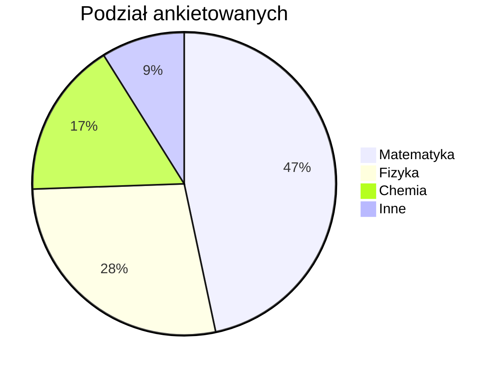

# Techniki Rysowania Grafik i Wykresów w MkDocs

Na tej stronie przedstawiono różne metody tworzenia i osadzania wizualizacji, od prostych obrazków po skomplikowane wykresy matematyczne, w dokumentacji opartej o MkDocs.

---

## 1. Obrazki Statyczne (PNG, JPG, SVG)

Najprostszą metodą jest wstawienie gotowego pliku graficznego. Jest to idealne rozwiązanie dla złożonych wykresów wygenerowanych w zewnętrznych programach.

### Krok po kroku:

1.  **Wygeneruj wykres:** Użyj dowolnego narzędzia, które potrafi eksportować grafikę. Dla celów matematycznych, biblioteki Pythona takie jak **Matplotlib** lub **Plotly** są doskonałym wyborem.

    *Przykład w Pythonie (Matplotlib):*
    ```python
    import matplotlib.pyplot as plt
    import numpy as np

    x = np.linspace(0, 2 * np.pi, 400)
    y = np.sin(x**2)

    plt.figure()
    plt.plot(x, y)
    plt.title("Wykres funkcji sin(x^2)")
    plt.xlabel("x")
    plt.ylabel("y")
    plt.grid(True)
    
    # Zapisz wykres do pliku w katalogu docs/assets
    plt.savefig("docs/assets/wykres_sin_x2.png")
    ```

2.  **Umieść plik w projekcie:** Zapisz wygenerowany plik (np. `wykres_sin_x2.png`) w odpowiednim miejscu w swoim projekcie, na przykład w katalogu `docs/assets/`.

3.  **Wstaw obrazek w Markdown:** Użyj standardowej składni Markdown, aby wstawić obrazek na stronę.

    ```markdown
    
    ```

---

## 2. Wbudowane Grafiki SVG

Możesz osadzać kod SVG bezpośrednio w pliku Markdown. Daje to dużą kontrolę nad wyglądem i pozwala na tworzenie prostych, skalowalnych grafik bez dodatkowych plików. Widziałeś już ten mechanizm w pliku `metryki_topologia.md`.

### Przykład: Prosta parabola

Poniższy kod SVG rysuje wykres funkcji $y = x^2$.

```html
<div style="text-align: center;">
<svg width="200" height="200" viewBox="-2 -1 4 4" xmlns="http://www.w3.org/2000/svg">
  <g transform="scale(1,-1) translate(0, -1.5)">
    <!-- Osie -->
    <line x1="-2" y1="0" x2="2" y2="0" stroke="black" stroke-width="0.05"/>
    <line x1="0" y1="-0.5" x2="0" y2="2" stroke="black" stroke-width="0.05"/>

    <!-- Wykres paraboli y=x^2 -->
    <polyline points="-1.5,2.25 -1,1 -0.5,0.25 0,0 0.5,0.25 1,1 1.5,2.25" 
              fill="none" stroke="purple" stroke-width="0.1"/>
  </g>
</svg>
</div>
```

<div style="text-align: center;">
<svg width="200" height="200" viewBox="-2 -1 4 4" xmlns="http://www.w3.org/2000/svg">
  <g transform="scale(1,-1) translate(0, -1.5)">
    <!-- Osie -->
    <line x1="-2" y1="0" x2="2" y2="0" stroke="black" stroke-width="0.05"/>
    <line x1="0" y1="-0.5" x2="0" y2="2" stroke="black" stroke-width="0.05"/>

    <!-- Wykres paraboli y=x^2 -->
    <polyline points="-1.5,2.25 -1,1 -0.5,0.25 0,0 0.5,0.25 1,1 1.5,2.25" 
              fill="none" stroke="purple" stroke-width="0.1"/>
  </g>
</svg>
</div>

---

## 3. Diagramy za pomocą Mermaid

**Mermaid** to potężne narzędzie do tworzenia diagramów i wykresów z tekstu. Aby z niego korzystać, prawdopodobnie będziesz musiał aktywować odpowiednie rozszerzenie w pliku `mkdocs.yml` (np. `pymdownx.superfences`).

### Przykład: Wykres kołowy



### Przykład: Wykres XY (eksperymentalny)

Mermaid oferuje również (wciąż w fazie rozwoju) możliwość tworzenia wykresów XY, co może być przydatne do wizualizacji danych matematycznych.

```mermaid
xychart-beta
    title "Wykres funkcji"
    x-axis [0, 1, 2, 3, 4, 5]
    y-axis "Wartość" [0, 10, 40, 20, 50, 30]
    line [10, 40, 20, 50, 30, 60]
    bar [5, 12, 15, 8, 22, 18]
```

---

## 4. Zaawansowane Wizualizacje: LaTeX i TikZ

Dla najwyższej jakości rysunków matematycznych, zwłaszcza w publikacjach naukowych, używa się pakietu **TikZ** dla LaTeX. Integracja z MkDocs jest bardziej skomplikowana i może wymagać specjalnych wtyczek (np. `mkdocs-tikz`), ale daje niemal nieograniczone możliwości.

### Przykład: Rysunek w TikZ

Poniższy kod (w składni LaTeX) rysuje prosty graf.

```latex
\begin{tikzpicture}
    \node[draw, circle] (a) at (0,0) {A};
    \node[draw, circle] (b) at (2,1) {B};
    \node[draw, circle] (c) at (2,-1) {C};

    \draw[->] (a) -- (b);
    \draw[->] (a) -- (c);
    \draw[<->, dashed] (b) -- (c);
\end{tikzpicture}
```

Ta metoda jest najpotężniejsza, ale również wymaga największej wiedzy i odpowiedniej konfiguracji projektu.

